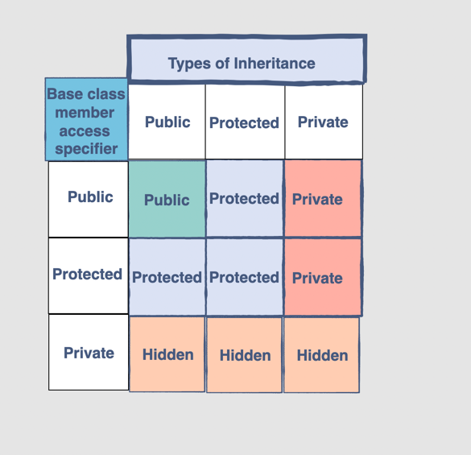
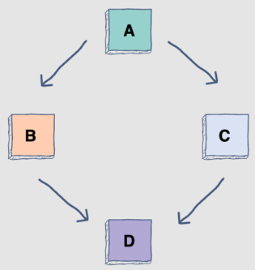

# OOP
This repository will contain OOP tricks about Cpp.

## List of Contents

### 1. Public Protected Private
```c++
class X {
private:
... <default is private>
protected:
...
public:
...
}
```

### 2. static

`static` is used for class variable/function

### 3. scope operator `::`
Scope operator can be used to refer to function definition, this can be used with header file. (Class scope defined in header & implemented by class file)
```c++
class Rectangle {
  int length;
  int width;

  public:
  
  // We only write the declaration here
  void setLength(int l);
  int area();
};

// Somewhere else in the code
void Rectangle::setLength(int l){ // Using the scope resolution operator
  length = l;
}

int Rectangle::area(){
  return length * width; 
}
```

### 4. this
`this->...` this in Cpp is a pointer

### 5. Special Constructors
This is where Cpp start to become evil, before start, go through:
- what is lvalue & rvalue in Cpp: https://www.youtube.com/watch?v=fbYknr-HPYE
- example about [different constructors]()
- what is `move` and [why should we use it](05_what%20is%20move%20and%20why%20use%20move.pdf)
- [is return rvalue more efficient](05_is%20return%20rvalue%20more%20efficient.pdf)
- [why do we need rvalue](05_why%20do%20we%20need%20rvalue.pdf)
  - [rvalue use case for vector](05_rvalue_for_vector.pdf) Note that push back will create a copy, use pointer for higher efficiency
  - [how to only allow move constructor](05_how_to_only_allow_move_constructor.pdf)
  - perfect forwarding (to be documented...)

Note: 
**Copy assign constructor/move assign constructor will only be called if the LHS of `=` expression is an already existing object.**
```c++
classType className = ...
```
Will cause copy/move/parameter match constructor based on `...` and
```c++
classType className;
...
className = ...;
```
Will cause copy/move assign constructor based on `...` if lvalue reference or rvalue reference or not.
#### 1 Copy Constructor
The copy constructor allows a class to create an object by copying an existing object.
```c++
class Account{
public:
    Account(const Account& other);
};
```
1. const to make sure that the original copy cannot be altered
2. We have to manually copy everything, like: `this->x = other.x`

#### 2 Move Constructor
After knowing that lvalue & rvalue is, we know that there are some temporary values throughout the code.
Thus, we can directly push the temporary value to constructor. This is known as move constructor. It
accepts rvalue reference `type&&`. The code looks like:

```c++
class Account{ 
public:
      Account(Account&& other);
};
```
[Here is a post talking about when move/copy constructor will be called](
https://zhuanlan.zhihu.com/p/365412262)\
[Or reference to the code example](05_constructors.cpp)

#### 3 Explicit Constructor
This only allow explicit construction, so `=` operator have to be defined through operator overload. And any undefined
conversion (implicit that expect default behaviour) will cause error.
```c++
class Account{
public:
    explicit Account(double b): balance(b){}
    Account (double b, std::string c): balance(b), cur(c){} 
private:
    double balance;
    std::string cur;
};
Account account = 100.0; // ERROR: implicit conversion
Account account(100.0); // OK: explicit invocation
```

#### 4 Copy Assign Operator
Overload `=` operator.
```c++
class Account{
public:
    ...
    Account& operator= (Account& acc): {
        this->id = acc.id;
        return *this;
    }
private:
    int id;
};
```

#### 5 Move Assign Operator
Overload `=` operator.
```c++
class Account{
public:
    ...
    Account& operator= (Account&& acc): {
        this->id = acc.id;
        return *this;
    }
private:
    int id;
};
```

### 6. Constructor Delegation
This is just to define some default behaviour of some constructor
```c++
class Account{
  Account(): Account(0) {}
  Account(int id): id(id) {}
private:
  int id;
};
```

### 7. Destructors
Explicit defines clean up step.`~ClassName` to define destructor For example, this is an use case of destructor.
It is not possible to define more than one destructor. The destructor is only one way to destroy the object create by constructor. 
Hence, destructor can-not be overloaded. Note that compiler will handle destruction not allocated through new. But for pointers,
del ptr, will cause destruction manually.

Note we might want to make destructor virtual for diamond problem.
```c++
class Collector {
  int * list;
  int size;
  int capacity;

  public:
  // Default constructor
  Collector(){
    // We must define the default values for the data members
    list = nullptr;
    size = 0;
    capacity = 0;
  }
  
  // Parameterized constructor
  Collector(int cap){
    // The arguments are used as values
    capacity = cap;
    size = 0;
    list = new int[capacity];
  }

  bool append(int v){
    if (size < capacity) {
      list [ size++ ] = v;
      return true;
    }
    return false;
  }

  // A simple print function
  void dump(){ 
    for(int i = 0 ; i < size ; i++) {
      cout << list[i] << " ";
    }
    cout << endl;
  }
  
  ~Collector(){
    cout << "Deleting the object " << endl;
    if (capacity > 0)
      delete[] list; 
  }
};
```

### 8. `Default` and `Delete` [Check Code]
A default constructor is a constructor that either has no parameters, or if it has parameters, 
all the parameters have default values. If no user-defined constructor exists for a class A and one is needed, 
the compiler implicitly declares a default parameterless constructor. For example:
```c++
Account() = default;
```
By using delete, we can define purely declaratively that an automatically generated method from the compiler is not available.
So in this way we can **BAN** some features, like ban copy/move constructor etc... Here is a full list of example:

#### 1 Non-copyable but movable
```c++
class NonCopyableClass{
  public:

  // state the compiler generated default constructor
  NonCopyableClass()= default;

  // disallow copying
  NonCopyableClass& operator = (const NonCopyableClass&) = delete;
  NonCopyableClass (const NonCopyableClass&) = delete;
  
  // allow moving
  NonCopyableClass& operator = (NonCopyableClass&&) = default;
  NonCopyableClass (NonCopyableClass&&) = default;
};
```
In the same way we can define non-movable class. By BAN the new operator:

#### 2 Class cannot be `new` (cannot create on stack)

```c++
class TypeOnStack {
  public:
    void * operator new(std::size_t)= delete;
};
```

#### 3 Class do not have desctructors can only be created by new
Note even if you new this, you still can't delete it.
```c++
class TypeOnHeap{
  public:
    ~TypeOnHeap()= delete;
};
```

### 9. `friend` function
A friend function is an independent function which has access to the variables and methods of its befriended class. 
Whatever function defined as friend in class declaration is immune to `private`.

### 10. `struct` & `unions`
Structs are almost identical to classes. The default access specifier for a struct is public instead of private.


A union is a special data type where all members start at the same address. A union can only hold one type at a time, therefore, we can save memory. A tagged union is a union that keeps track of its types. By using union, we are actually pointing to the same memory for the different data types used.
```c++
union UnionClass {
    datatype1 dt;
    ...
    datatypen dtn;
};
```

### 11. Header file
Check code example:
  - [Class File](11_header.cpp)
  - [Header File](11_header.h)
#### In header
```c++
#ifndef namespace
#define namespace

class skeleton {
    ...
};

#endif
```

#### In class file
```c++
#include "headerfile"

return type ClassName::functionName() {
    ...
}
```

#### In file that needs to use the implementation
```c++
#include "headerfile"
...
```

### 12. Inheritance
`class derivedClassName : <modeOfInheritance> baseClassName`
modeOfInheritance include: public, private, protected, which controls to which level can the derived class
access features of base class.


#### 1 Construction & Destruction
Construction sequence: Base -> Derived \
Destruction  sequence: Derived -> Base

#### 2 Override
```c++
class BaseClass {
public:
    void say(){
        std::cout << "Base" << std::endl;
    }
};

class DerivedClass: public BaseClass {
    void say(){
        BaseClass::say();
        ... further implements
    }
};
```

Note: **Overriding a function in a derived class hides all the overloads of the same function from the base class.**

#### 3 Multiple Inheritance
```c++
class Derived : public Base1 , public Base2 , ...
```

#### 4 Multilevel Inheritance
```c++
class parent
class child : public parent
class grandChild : public child
```

#### 5 Diamond Problem
 \
This is when B&C have same function inherited from A, so if D call the constructor, then 
compiler cannot figure out which one it is referring to. For the code below for example, compiler
do not know getID() will from which (both B&C have an ID from A).
```c++
#include<iostream>
using namespace std;
 
class A
{
protected:
    int ID;
public:
    A() : ID(0) { }
};
 
class B:  public A
{
public:
    int length;
};
 
class C:  public A
{
public:
    int radius;
};
 
class D: public B, public C
{
public:
    int getID()  {   return ID;  }
};
 
int main(void)
{
    D d;
    cout << d.getID();
    return 0;
}
```

One solution would be : `C::ID` or `D::ID`, however, this will cause memory waste(double piece of memory).

So instead, use `virtual`
```c++
#include<iostream>
using namespace std;
 
class A
{
protected:
    int ID;
public:
    A() : ID(0) { }
};
 
class B:  virtual public A
{
public:
    int length;
};
 
 
class C:  virtual public A
{
public:
    int radius;
};
 
class D: public B, public C
{
public:
    int getID()  {   return ID;  }
};
 
int main(void)
{
    D d;
    cout << d.getID();
    return 0;
}
```
This will make sure only one copy of replicated is generated.

#### 6 `override` & `final`
The override keyword in a method declaration expresses that the method should override a virtual method of a base class.
It is like a declaration.

`final` supports two use cases. First, we can declare a method that cannot be overridden; second, 
we can define a class that cannot be derived from.
```c++
void func() final;
virtual void func() final override;
```

These two keywords are used by compilers to make sure programmer follow the constraint.

#### 7 Virtual function
If we want to achieve polymorphism, we should override the base function of base class. But in this way, we will notice 
that it is using the behavior of based function. In order to let it behave as derived functions, we need to mark the function
of original class as virtual:
```c++
class Base {
public:
    void virtual greeting() {
        std::cout << "hi" << std::endl;
    }
};

class Derived: public Base {
public:
    void greeting() {
        std::cout << "hello" << std::endl;
    }    
};
```
[Check the code example](12_7_virtual_functions.cpp) Note: use pointer, copy constructor will not achieve polymorphism.

Furthermore, we would like to completely BAN the function of base class and just use it as a placeholder, this force subclass
to override the function (like abstraction in other language). This can be done via pure virtual `=0`
```c++
class Shape {
  public:
  virtual float getArea() = 0;
};

class Rectangle : public Shape {
  public:
  float getArea(){ return 1; }
};
```

### 13. Operator OverLoading
We can overload how operator will behave. This is especially powerful for objects. Note return the reference of original.
This is especially powerful.

One tricky thing is the difference between `return_type` & `return_type&` during operator overload. Which is perfectly explained by:
- [the video](https://www.youtube.com/watch?v=9WPUU9Uzaus)
- [this code](13_operator_overload.cpp) \
It is useful in sequential equal: `a = b = c = ...` Cpp default `=` operator return reference and that is why sequential equal works.
- For assignment operator check constructor above.
- For type conversion check code.
#### += overload
We can pass 2 arguments as well, just make it `friend Account& operator += (Account &a, Account &b);` and define outside. It behave same
as one parameter. The first parameter refers to the one on LHS of operator.
```c++
class Account{
    double balance;
    Account& operator += (double b){
        balance += b;
        return *this;
    }
};
```
#### new overload
```c++
class Account{
    double balance;
    void* operator new (std::size_t){
        return nullptr;
    }
};
```
#### << overload
This is same as defined toString() in other language.
```c++
#include <iostream>

class Account{
    double balance;
    friend std::ostream& operator << (std::ostream& os, const Account& a);
};

std::ostream& operator << (std::ostream& os, const Account& a){
   os << a.balance;
   return os;
}
```

#### Type change overload
```c++
class MyBool{
public:
  explicit operator bool(){return true;}
};

MyBool x;
if (x) {
    ...
}
```

#### Operators cannot be overload
`.` `::` `?:` `sizeof` `.*` `typeof`

### 14. Call Operator
**Functor**, is a class or struct that can be called like functions.
We make it callable through override the `()` parentheses operator

### 15. Aggregation vs Composition
Aggregation: Lifetime of submodule not depend on the one contains it.
Composition: Lifetime of submodule determined by the one contains it.