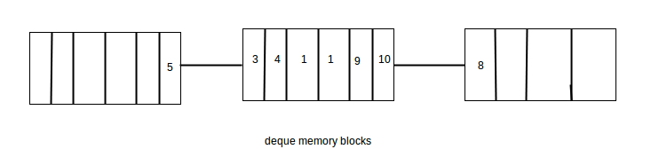

# Cpp Standard Library
This folder contains discussion about standard library.

Standard library can be classified into:
- Containers: container of different variables
- Algorithms: different common operations on stuff from containers
- Iterators: provides access point for containers which is used by algorithms, it states as a bridge between Containers & Algorithms

## List of Contents
- **1 Namespace**
- **2 Common Functions**
  - std::min, std::max
  - std::move
  - std::forward
  - std::swap
- **3 Other Useful Functions**
  - std::bind & std::function
  - tuples & pairs
  - reference wrappers
- **4 Smart Pointers**
  - `std::unique_ptr`
  - `std::shared_ptr`
  - `std::weak_ptr`
- **5 Type Traits**
- **6 Time Library**
- **7 any, optional, variant**
- **8 Containers**
  - General Operations
  - Sequential
  - Associative
    - Ordered
    - Unordered
  - Adaptors
  - Iterators

<details><summary>1 Namespace</summary>

## 1 Namespace
When we want to include some standard libraries (or header files), we should:
```c++
#include <header_file_name>
```

### Basics of Namespace
Refer to [basics of namespace](001_Namespace/001_Cpp_namespace_basics.pdf) (https://www.geeksforgeeks.org/namespace-in-c/)

We can refer to a namespace by:
```c++
...
namespace namespace_name {
    ... variable definition ...
    ... function definition ...
    ... clss     definition ...
}

namespace_name::variable/function/clss to access objects within functions
```
We can have more than one namespace
```c++
namespace name1 {
    ...
}

namespace name2 {
    ...
}
```

Moreover, since we have to access the variable within those namespaces by: `namespace_name::variable_name`, we can simplify the access by:
- `using`
```c++
using namespace namespace_name; // all variable within this namespace can be called directly
```
- single `using`
```c++
using namespace_name::variable_name; // can call variable_name directly
```
- namespace alias
```c++
alias_name = namespace_name::variable_name;
```

Here is a complete [coding example]()

**A very important note is that if we import something/using something in a cpp file and import it in main, then 
namespace within the file being imported is also visible in main. That is why we should use namespace directly to avoid 
namespace pollution and collision.** 

- same namespace --> same variable (defined in different file) --> error
- different namespace --> same variable --> error if we call the function

</details>

<details><summary>2 Common Functions</summary>

## 2 Common Functions
### 1 std::min & std::max

Check the [code](002_Common_Functions/min_max.cpp) here for an example.

```c++
min(a, b) // Returns the minimal value of a and b.
min(a, b, comp) // Returns the minimal value of a and b according to the predicate comp.
min(initializer list) // Returns the minimal value of the initializer list.
min(initializer list, comp) // Returns the minimal value of the initializer list according to the predicate comp.

// Same works for max/minmax
```
Note that comparator will determine which one is smaller (return true if first argument is smaller than the second one)

### 2 std::move
- First we have to understand what is lvalue and what is rvalue: [video](../02_OOP/BackUpOfVideoReference/lvalues%20and%20rvalues%20in%20C++.mp4)
- Then the following two video give a very good explanation around move semantics
  - [move semantics](002_Common_Functions/BackUpVideos/Move%20Semantics%20in%20C++.mp4)
  - [move operator and std::move](002_Common_Functions/BackUpVideos/stdmove%20and%20the%20Move%20Assignment%20Operator%20in%20C++.mp4)


1. According to function `test_access_object_after_move()` in [file](002_Common_Functions/move.cpp). We can see that object is accessible
even after we call std move on that.
2. `std::move(obj)` does nothing more than convert the object namespace into a rvalue reference. So that it can be used 
for (move constructor, move assign constructor, any place/functions that designed to use of temporary value (rvalue))
3. Yes it is possible to write logic of move stuff (rather than copy) in a copy assign/copy constructor. It is totally possible. But 
we programmers are responsible for write move logic/ copy logic within corresponding functions.

Referring to the video, here is an example of why/how we should use move.
```c++

class MY_STRING{
public:
  char* my_str;
  size_t str_length;
  MY_STRING() {
    this->my_str = nullptr;
    this->str_length = 0;
  }
  
  MY_STRING(int size) {
    this->str_length = size;
    this->my_str = new char[size];
  }
  
  MY_STRING(const MY_STRING& other) {
  
    this->str_length = other.str_length;
    this->my_str = new char[this->str_length];
    memcpy(this->my_str, other.my_str, this->str_length);
  }
  
  MY_STRING(MY_STRING&& other) {
    this->str_length = other.str_length;
    this->my_str = other.my_str;
    other.my_str = nullptr;
    other.str_length = 0;
  }
  
  ~MY_STRING() {
    if (this->my_str) {
      delete [] this->my_str;
      this->my_str = nullptr;
    }
  }
};
```
- Use move constructor so that if we use other string(rvalue) to initialize, it will take over the object instead of 
create a new one. This will save one round of delete array in destructor and allocate memory for new array in constructor.
- Note that we need to set the original MY_STRING's pointer to an array to nullptr so when it is destructed rater than the 
object it moves value to, the underlying char array won't be deleted.

### 3 std::forward
Forward is used when we have nested functions, we pass the argument from first function to next one, we need to use forward
to make sure the data type is not changed. For example: 
- For function templates: https://www.youtube.com/watch?v=srdwFMZY3Hg
- For move constructor [Example Code](/03_Standard_Library/002_Common_Functions/forward.cpp)

It will preserve the lvalue/rvalue reference characteristics and can achieve generics.The function std::forward, 
defined in the header <utility>, empowers you to write function templates, which can identically forward their arguments.
The power of forward will be revisited at template section.

### 4 std::swap
As the code shown :)
```c++
// swap.cpp
...
#include <utility>
...
template <typename T>
inline void swap(T& a, T& b){
  T tmp(std::move(a));
  a= std::move(b);
  b= std::move(tmp);
}
```

</details>


<details><summary>3 Other Useful Functions</summary>

## 3 Other useful functions

### 1 std::bind & std::function & std::placeholders
`std::bind` will take a function and placeholder to formulate new callable object. Which is of type `std::functions`. 
They are all from the header file `<functional>`

Also, use `std::placeholders::_1` ... `std::placeholders::_10` for placeholder. 

The function should have formatted: `function <returnType(placeHolder types...)>` or can just be captured by `auto`

[Example Code Playground](003_Other_Useful_Functions/bind.cpp)

```c++
#include <iostream>
#include <functional>

// for placehoder _1 and _2
using namespace std::placeholders; 

using std::bind;
using std::function;

double divMe(double a, double b){ return a/b; };

int main(){
  std::cout << std::boolalpha;
  function < double(double, double) > myDiv1= bind(divMe, _1, _2);
  function < double(double) > myDiv2= bind(divMe, 2000, _1);
  std::cout << (divMe(2000, 10) == myDiv1(2000, 10)) << '\n';
  std::cout << (myDiv1(2000, 10) == myDiv2(10));
}
```

### 2 pairs & tuples
`std::pair` within `<utility>`
- Defined as `std::pair<type1, type2>` 
- Defined as `std::make_pair(var1, var2)`
- Access by: `pairObj.first`, `pairObj.second`, `std::get<0>(pairObj)`, `std::get<1>(pairObj)`

```c++
// pair.cpp
#include <iostream>
#include <utility>
using namespace std;

int main(){
  pair<const char*, double> charDoub("str", 3.14);
  pair<const char*, double> charDoub2 = make_pair("str", 3.14);
  auto charDoub3 = make_pair("str", 3.14);

  cout << charDoub.first << ", " << charDoub.second << "\n";    // str, 3.14
  charDoub.first = "Str";
  get<1>(charDoub) = 4.14;
  cout << charDoub.first << ", " << charDoub.second << "\n";    // Str, 4.14
  
  return 0;
}
```

`std::tuple`
- Defined as `std::tuple<type1, type2, ...>`
- Defined as `std::make_tuple(var1, var2, ...)`
- Access by: `std::get<x>(tupleObject)`

```c++
#include <iostream>
#include <tuple>
using std::get;

int main(){
  std::tuple<std::string, int, float> tup1("first", 3, 4.17f);
  auto tup2= std::make_tuple("second", 4, 1.1);

  std::cout << get<0>(tup1) << ", " << get<1>(tup1) << ", " << get<2>(tup1) << std::endl; // first, 3, 4.17
  
  std::cout << get<0>(tup2) << ", " << get<1>(tup2) << ", " << get<2>(tup2) << std::endl; // second, 4, 1.1

  std::cout << (tup1 < tup2) << std::endl; // true

  get<0>(tup2)= "Second";

  std::cout << get<0>(tup2) << "," << get<1>(tup2) << "," << get<2>(tup2) << std::endl;  // Second, 4, 1.1

  std::cout << (tup1 < tup2) << std::endl; // false

  auto pair= std::make_pair(1, true);
  std::tuple<int, bool> tup= pair;
  
  return 0;
```

The tuple has, like his younger brother std::pair, a default, a copy, and a move constructor. You can swap tuples with the function std::swap.

### 3 Reference Wrappers
A reference wrapper is a copy-constructive and copy-assignable wrapper for an object of type&, which is defined in the 
header `<functional>`.

声明于 <functional> 中的 class std::reference_wrapper<> 主要用来“喂 ” reference 给function template, 后者原本以 by value方式接受参数。对于一个给定类型 T ，这个 class 提供 `ref ()` 用以隐式转换为 `T&` ，一个 `cref ()` 用以隐式转换为 `const T&` ，这往往允许 function template 得以操作 reference 而不需要另写特化版本。

`auto r = ref(o)` is same as `reference_wrapper<dectype(o)> r(o)`

For example ([source code](./003_Other_Useful_Functions/reference_wrapper.cpp))

```c++
#include <iostream>
#include <functional>

template<typename T>
void functest(T a) {
    ++a;
}

void test_reference_wrapper() {
    int a = 1;
    int &b = a;
    std::cout << "a address: " << &a << std::endl;
    std::cout << "b address: " << &b << std::endl;

    std::cout << "a before functest: " << a << std::endl;
    //functest(a); // a = 1
    //functest(b); // a = 1
    functest(std::ref(a)); // a = 2
    std::cout << "a after  functest: " << a << std::endl;
}
```
Since the template function is taking a pass by value argument, thus changes will not be made on `a`, only if we pass 
reference of `a` to it.

Another example:
```c++
void myAdd(int a, int b, int &r) {
    r = a + b;
}

void test_reference_wrapper_2(){
    int result = 0;
    auto f = std::bind(myAdd, std::placeholders::_1, 20, result);
    f(10);
    std::cout << "result after  myAdd: " << result << std::endl;
}
```
The following function won't change `result`, since bind will make f do not know if result is still valid at the time of
calling the function, so it will use pass by value instead. if we change to `std::ref(result)`, then the change will work.

If object do not support transferring from reference wrapper to original object. We need to use `get()` to get the original object.

What really makes `ref()` and `cref()` so important is that it works with STL. So vector push_back for example won't do a copy constructor.
```c++
#include <algorithm>
#include <list>
#include <vector>
#include <iostream>
#include <numeric>
#include <random>
#include <functional>
 
void print(auto const rem, std::ranges::range auto const& v) {
    for (std::cout << rem; auto const& e : v)
        std::cout << e << ' ';
    std::cout << '\n';
}
 
int main()
{
    std::list<int> l(10);
    std::iota(l.begin(), l.end(), -4);
 
    // can't use shuffle on a list (requires random access), but can use it on a vector
    std::vector<std::reference_wrapper<int>> v(l.begin(), l.end());
 
    std::ranges::shuffle(v, std::mt19937{std::random_device{}()});
 
    print("Contents of the list: ", l);
    print("Contents of the list, as seen through a shuffled vector: ", v);
 
    std::cout << "Doubling the values in the initial list...\n";
    std::ranges::for_each(l, [](int& i) { i *= 2; });
 
    print("Contents of the list, as seen through a shuffled vector: ", v);
}
```
will output
```c++
Contents of the list: -4 -3 -2 -1 0 1 2 3 4 5 
Contents of the list, as seen through a shuffled vector: -1 2 -2 1 5 0 3 -3 -4 4 
Doubling the values in the initial list...
Contents of the list, as seen through a shuffled vector: -2 4 -4 2 10 0 6 -6 -8 8
```

Note that reference wrapper are just a wrapper for pointer, which provide accessor `get()`.
</details>

<details><summary>4 Smart Pointers</summary>

## 4 Smart Pointers

### 1 `std::unique_ptr`
[Reference from source](./004_Smart_Pointers/std__unique_ptr%20-%20cppreference.com.pdf)
- `std::unique_ptr` is a smart pointer that owns and manages another object through a pointer and disposes of that object when the unique_ptr goes out of scope.
- The object is disposed of, using the associated deleter when either of the following happens:
  - the managing unique_ptr object is destroyed
  - the managing unique_ptr object is assigned another pointer via `operator=` or `reset()`.


It is only move constructable, so enable unique ownership. (after move construct, pointer of original source will be changed to `null_ptr`)

For c++14+ , use `std::make_unique` instead for safety.

APIs:
- `reset()` : Resets the resource.
- `release()` : Returns a pointer to the resource and releases it.
- `swap()` : Swaps the resources.
- `get()` : Returns a pointer to the resource.
- `get_deleter()` : Returns the delete function.
- `operator*` : `*` de-referencing the underlying object
- `operator->` : `->` access the underlying object
- `operator[]` : `[]` de-referencing the underlying object


[Example Code](./004_Smart_Pointers/unique_pointer.cpp)
- `test_unique_pointer()`:
  - how unique pointer should be created (`unique_ptr<T> ptr = unique_ptr<T>(new object(...))`), or replace `new object(...)`
  with a pointer pointing to object on heap
  - get deleted as long as code goes out of scope (call destructor of object)
  - get error if passed an object on stack
- `test_unique_pointer_1()`:
  - reset
  - release
  - move constructor
  - swap
- `test_unique_pointer_2()`:
  - self defined deleter : deleter needs to be callable with argument of pointer to the object type
  - `*`, `->`, `[]`

**Note that!!** It is impossible to change the underlying object without knowledge of ptr:
```c++
auto ptr = unique_ptr<T>(new T(...));
ptr.get() = new T(...);
```
Will cause an error since `.get()` only return rvalue.

An linked-list example from source:
```c++
// unique_ptr-based linked list demo
struct List
{
    struct Node
    {
        int data;
        std::unique_ptr<Node> next;
    };
 
    std::unique_ptr<Node> head;
 
    ~List()
    {
        // destroy list nodes sequentially in a loop, the default destructor
        // would have invoked its `next`'s destructor recursively, which would
        // cause stack overflow for sufficiently large lists.
        while (head)
            head = std::move(head->next);
    }
 
    void push(int data)
    {
        head = std::unique_ptr<Node>(new Node{data, std::move(head)});
    }
};
```
It makes the object delete by `head = std::move(head->next);` which push head object out of scope and cause unique_ptr automatically delete get triggerred.

### 2 `std::shared_ptr`

`std::shared_ptr` is copy/move constructable.

`std::shared_ptr` shares ownership of the resource. They have two handles: one for the resource, and one for the 
reference counter. By copying an `std::shared_ptr`, the reference count is increased by one. It is decreased by one if the
`std::shared_ptr` goes out of scope. If the reference counter becomes the value 0, the C++ runtime automatically 
releases the resource.

APIs:
- everything `unique_ptr` has
- `use_count()` : Returns the value of the reference counter.
- `unique()` : Checks if the std::shared_ptr is the exclusive owner of the resource.

Using the `class std::enable_shared_from_this`, we can create objects that return an `std::shared_ptr` to themselves. 
To do so, we must publicly derive the class from `std::enable_shared_from_this`. So the class ShareMe support the method 
shared_from_this, and return `std::shared_ptr`. (Have to create the shared pointer once `shated_ptr<...>(obj)` then 
`obj.shared_from_this()`) can work.

[Example code](./004_Smart_Pointers/shared_ptr.cpp):
- test_shared_ptr:
  - `use_count`
  - `unique`
  - `shared_from_this`
  - `ptr when goes out of scope will get destroyed`
  - `reset will not change the object of other holder, but will cause counter decrease by one`

[Educative site](https://www.educative.io/module/lesson/cpp-standard-library/gxEqV8PQYDY) give an good example about custom
deletor via callable.

### 3 `std::weak_ptr`
`std::weak_ptr` is not a classic smart pointer, since it supports no transparent access to the resource, it only borrows
the resource from a `std::shared_ptr`. It is introduced to solve cyclic reference problem. 
- Create a weak pointer won't increase shared_ptr count.
- The constructor take shared pointer as argument

APIs:
- `expired()` : Checks if the resource was deleted.
- `lock()` : Creates a `std::shared_ptr` on the resource.
- `reset()` : Resets the resource.
- `swap()` : Swaps the resources.
- `use_count()` : 	Returns the value of the reference counter.
<details><summary>Code shows the usage</summary>

```c++
#include <iostream>
#include <memory>

int main(){

  std::cout << std::boolalpha << std::endl;

  auto sharedPtr=std::make_shared<int>(2011);
  std::weak_ptr<int> weakPtr(sharedPtr);
  
  std::cout << "weakPtr.use_count(): " << weakPtr.use_count() << std::endl;
  std::cout << "sharedPtr.use_count(): " << sharedPtr.use_count() << std::endl;
  std::cout << "weakPtr.expired(): " << weakPtr.expired() << std::endl;

  if( std::shared_ptr<int> sharedPtr1 = weakPtr.lock() ) {
    std::cout << "*sharedPtr: " << *sharedPtr << std::endl;
    std::cout << "sharedPtr1.use_count(): " << sharedPtr1.use_count() << std::endl;
  }
  else{
    std::cout << "Don't get the resource!" << std::endl;
  }

  weakPtr.reset();
  if( std::shared_ptr<int> sharedPtr1 = weakPtr.lock() ) {
    std::cout << "*sharedPtr: " << *sharedPtr << std::endl;
    std::cout << "sharedPtr1.use_count(): " << sharedPtr1.use_count() << std::endl;
  }
  else{
    std::cout << "Don't get the resource!" << std::endl;
  }

  std::cout << std::endl;

}
```

```c++
/*
weakPtr.use_count(): 1
sharedPtr.use_count(): 1
weakPtr.expired(): false
*sharedPtr: 2011
sharedPtr1.use_count(): 2
Don't get the resource!
*/
```
</details>

We get cyclic references of `std::shared_ptr` if they refer to each other. If we have a cyclic reference of 
`std::shared_ptr`, the reference counter will never become 0. If we get a cyclic reference, then both object will never 
be released cause memory leakage.

### 4 Performance comparison
`void(*)` pure pointer > `unique_ptr` > `make_unique` > `shared_ptr` > `make_shared`

### 5 Different ways to pass smart pointer
1. `func(unique_ptr<T> ptr)` 
- Express that a function assumes ownership of object T.
- Pass the argument like: `unique_ptr<T> ptr; func(std::move(ptr));` To trigger the move constructor
- Returns the rvalue reference of pointer afterward if still want to use it.

2. `func(unique_ptr<T>& ptr)`
- Used to `reset()` or modify something related to pointer (instead of object itself)
- Pass the argument like: `unique_ptr<T> ptr; func(ptr);`

3. `func(shared_ptr<T> ptr)`
- For the lifetime of the function body, this method is a shared owner of the resource. At the start of the function 
body, we will increase the reference counter (pass by value); at the end of the function, we will decrease the reference
counter; therefore, the resource will stay alive, as long as we use it.

4. `func(shared_ptr<T>& ptr)`
- Not a shared owner so no guarantee the lifetime of object
- More likely used to reset() or modify something about the `shared_ptr` itself rather than underlying object

5. `func(const shared_ptr<T>& ptr)`
- Cannot change ptr
- To be honest, we should use a pointer `(T*)` or a reference `(T&)` as a parameter instead, because there is no added 
value in using a  `std::shared_ptr`.

</details>

<details><summary>5 Type Traits</summary>

## 5 Type Traits
The `<type_traits>` library enables you to check, compare and modify types at compile time. So, there is no overhead on the runtime of your program.

The type traits library and the function static_assert are a powerful pair. 
- On one side, the functions of the type traits library provide the type information at compile time. 
- On the other side, the static_assert function checks the given information at compile time.

```c++
#include <type_traits>
template <typename T> T fac(T a){
     static_assert(std::is_integral<T>::value, "T not integral");
     //...
}
fac(10);
fac(10.1); // with T= double; T not integral
```

Here are some examples of using type traits, all used as `static_assert(std::is_...(T)::value, "msg_if_false")`
```c++
template <class T> struct is_void;
template <class T> struct is_null_pointer;
template <class T> struct is_integral; 
template <class T> struct is_floating_point; 
template <class T> struct is_array;
template <class T> struct is_pointer;
template <class T> struct is_member_object_pointer;
template <class T> struct is_member_function_pointer;
template <class T> struct is_enum;
template <class T> struct is_union;
template <class T> struct is_class;
template <class T> struct is_function;
template <class T> struct is_lvalue_reference;
template <class T> struct is_rvalue_reference;
```
Also there are composite categories & type relationships: https://en.cppreference.com/w/cpp/header/type_traits \
For more details check: https://www.educative.io/module/lesson/cpp-standard-library/JPkDlpDXqlD


</details>

<details><summary>6 Time Library</summary>

## 6 Time Library

All defined in `#include <chrono>`

### 1 Clock
The clock consists of a starting point and a tick. So you can get the current time with the method now.
Different clock provided from   `std::chrono:: ...` have different property

- `std::chrono::system_clock`: System time, which you can synchronize with the external clock.
- `std::chrono::steady_clock`: Clock, which can not be adjusted.
- `std::chrono::high_resolution_clock`: System time with the greatest accuracy.

`std::chrono::system_clock` will refer typically to the 1.1.1970. You can not adjust `std::steady_clock` forward or 
backward in opposite to two other clocks. The methods `to_time_t` and `from_time_t` can be used to convert between 
`std::chrono::system_clock` and `std::time_t objects`.

### 2 Duration
`template <class Rep, class Period = ratio<1>> class duration;`
While rep means which datatype to store duration, period is unit time while ratio 1 is second.

```c++
typedef duration<signed int, nano> nanoseconds;
typedef duration<signed int, micro> microseconds;
typedef duration<signed int, milli> milliseconds;
typedef duration<signed int> seconds;
typedef duration<signed int, ratio< 60>> minutes;
typedef duration<signed int, ratio<3600>> hours;
```

`duration.count()` will return time in any unit/ratio you define. `ratio<x,y>` is off ratio x/y \
`ratio<1,1>` is one second

[Check the code](006_Time_Library/time_lib.cpp):
- `test_duration_count`: check how `count()` work
- `test_clock_casting`: convert between different unit of time duration
  - When Convert from lower larger unit to smaller unit, just use constructor: 
  `std::chrono::minutes m(hours)`, `std::chrono::seconds s(minutes)` ...
  - When Convert from smaller unit to larger unit use:
  `std::chrono::duration_cast<larger_unit>(smaller_unit)`

### 3 Time point
`any_clock.now()` will generate a clock. A time point is consist of a clock and a duration.

[Check the code](006_Time_Library/time_lib.cpp):
- `test_epoch`: epoch is usually 1970.1.1 and can check time until that
</details>

<details><summary>7 Any, Optional, Variant</summary>

## any, optional, variant

Every time you want to use a union use `std::variant`.

Every time you want to use a void* use `std::any`.

Every time you want to return nullptr as an indication of an error use `std::optional`.

### 1 [`std::any`](007_ANY_OPTIONAL_VARIANT/any.cpp)
`#include <any>` \
`std::any` is a type-safe container for single values of any type which is copy-constructible.

There are a few ways to create a `std::any` container `any`. 
- You can use the various constructors or the factory function `std::make_any`. 
- By using `any.emplace`, you directly construct one value into any. 
- `any.reset` lets you destroy the contained object.
- If you want to know whether the container any has a value, use the method `any.has_value`.
- You can even get the typeid of the container object via `any.type`. 
- Thanks to the generic function `std::any_cast` you have access to the contained object. If you specify the wrong type, you will get a `std::bad_any_cast exception`.

### 2 [`std::optional`](007_ANY_OPTIONAL_VARIANT/optional.cpp)
`#include <optional>`

The various constructors and:
- the convenience function `std::make_optional` let you define an optional object opt with or
without a value. 
- `opt.emplace` will construct the contained value in-place and opt.reset will destroy the container 
value. 
- You can explicitly ask a `std::optional` container if it has a value or you can check it in a logical expression.
- `opt.value` returns the value and 
- `opt.value_or` returns the value or a default value.
- If opt has no contained value, the call `opt.value` will throw a `std::bad_optional_access` exception.

### 3 [`std::variant`](007_ANY_OPTIONAL_VARIANT/variant.cpp)
`#include <variant>`

`std::variant` is a type-safe union. An instance of `std::variant` has a value from one of its types. 
- The type must not be a reference, array or void. 
- A `std::variant` can have a type more than once. 
- A default-initialised `std::variant` is initialised with its first type; therefore, its first type must have a default constructor. 
- By using `var.index` you get the zero-based index of the alternative held by the `std::variant var`.
- `var.valueless_by_exception` returns false if the variant holds a value. 
- By using `var.emplace` you can create a new value in-place. 
- There are a few global functions used to access a `std:variant`. 
  - The function template `var.holds_alternative` lets you check if the `std::variant` holds a specified alternative. 
  - You can use `std::get` with an index and with a type as argument. By using an index, you will get the value. 
  - If you invoke `std::get` with a type, you only will get the value if it is unique. If you use an invalid index or a non-unique type, you will get a `std::bad_variant_access exception`. 
  - In contrast to `std::get` which eventually returns an exception, `std::get_if` returns a null pointer in the case of an error.

`std::variant` has an interesting non-member function `std::visit` that allows you to execute a callable on a list of variants. So we don't have to access via `std::get<...>(...)`
```c++
  std::vector<std::variant<char, long, float, int, double, long long>>      
           vecVariant = {5, '2', 5.4, 100ll, 2011l, 3.5f, 2017};

  for (auto& v: vecVariant){        
    std::visit([](auto&& arg){std::cout << arg << " ";}, v);    
                                   // 5 2 5.4 100 2011 3.5 2017                
  }
```

</details>

<details><summary>8 Containers</summary>

## 8 Containers

### 1 General Operations

There are some general operations that is valid for all containers:
- Constructor (taking `std::vector` for example):
  - Default constructor: `std::vector<int> vec1`
  - Range: `std::vector<int> vec2(vec1.begin(), vec1.end())` [it will cause copy](008_Containers/general_operations.cpp)
  - Copy: `std::vector<int> vec3(vec2)` 
  - Copy: `std::vector<int> vec3= vec2`
  - Move: `std::vector<int> vec4(std::move(vec3))` [it won't cause any copy or move, and will clean the original container](008_Containers/general_operations.cpp)
  - Move: `std::vector<int> vec4= std::move(vec3)`
  - Sequence initializer list: `std::vector<int> vec5 {1, 2, 3, 4, 5}`
  - Sequence initializer list: `std::vector<int> vec5= {1, 2, 3, 4, 5}`
  - Destructor: `vec5.~vector()`
  - Clear Element: `vec5.clear()`

Because `std::array` is generated at compile-time, there are a few things that are special. `std::array` has no move 
constructor and can’t be created with a range or with an initializer list. However, a `std::array` can be initialized 
with an aggregate initialization. Also, `std::array` has no method for removing its elements.
- Size `cont #container`
  - `cont.size()` container size
  - `cont.empty()` check if empty (`empty()` is faster O(1) compared to `cont.size() == 0` O(n) and support readability)
- Access `cont #container`
  - `cont.begin()`, `cont.end()`: Pair of iterators to iterate forward.
  - `cont.cbegin()`, `cont.cend()`: Pair of iterators to iterate const forward.
  - `cont.rbegin()`, `cont.rend()`: Pair of iterators to iterate backward.
  - `cont.crbegin()`, `cont.crend()`: Pair of iterators to iterate const backward.
Note these are pointer, so `*(cont.begin()+x)` is indexing xth element.
- Assign & swap: `std::swap` can swap objects between containers (just swap, without recreate or whatever)
- Compare: `==`, `!=`, `<`, `>`, `<=`, `>=` (Unordered associative containers support only the comparison operator == and !=.)
  - Associate compare by: key1->value1->key2->value2->...
  ```c++
  map<int, string> uSet1{{1, "One"}, {3, "two"}};
  map<int, string> uSet2{{1, "one"}, {2, "Two"}};
  cout << (uSet1 < uSet2) << endl;     // 1
  ```
  
### 2 Sequential Containers

There are five sequential containers: `std::array`, `std::vector`, `std::deque`, `std::list`, `std::forward_list` \
Here is a comparison table:

[Code with test cases about sequential containers](008_Containers/sequential_containers.cpp)

#### [(1) `std::array`](https://en.cppreference.com/w/cpp/container/array)
- `std::array`'s memory is allocated at compile time. So do not support move constructor
- Constructor
  - `std::array<int, 10> arr`: The 10 elements are not initialized.
  - `std::array<int, 10> arr{}`: The 10 elements initialized to 0 by default.
  - `std::array<int, 10> arr{1, 2, 3, 4, 5}`: The unspecified elements are initialized to 0 by default.
- Access `arr`
  - `arr[n]` may work even if n out of bound
  - `arr.at(n)` will check at run time that if n goes out of bound, run time will throw
  - `std::get<n>(arr)` will check at compile time that if n > arr.size() will throw compile error

All others APIs are same as general operation for containers.

#### [(2) `std::vector`](https://en.cppreference.com/w/cpp/container/vector)

- `std::vector` is 95% solution
- Constructor
  - `std::vector<int> vec(10)` create with size 10
  - `std::vector<int> vec{10}` create with one element 10
  - `std::vector<int> vec(10, 1234)` create with size 10 and all fill with 1234
  - `std::vector<int> vec1(vec2.begin(), vec2.end())` this will result in copy of objects
  - `std::vector<int> vec1(std::move(vec2))` transfer objects & vec2 will have `nullptr` for underlying array
- `std::vector<cls> vec(n)` will create n objects by default constructor
- `vec.push_back(obj)`
  - Will add a copy of object (not object itself!! which will definitely cause copy construction unless pass a rvalue object to it) to the end of list
  - If reach maximum capacity, will double, and
    - copy all object of original vector to the new one if `cls(cls&& _) noexcept{}` is not available
    - move otherwise (MAKING MOVE CONSTRUCTOR noexcept!!!!!!)
- `vec.resize(x)`
  - if new size > current size, will push until `vec` have that many objects
  - if new size < current size, will delete until `vec` have that many objects
- `vec.insert(x)`
  - copy assignment will be called (not copy constructor) to move all other elements backward by one
  - x will be inserted via copy/move constructor follow the same rules as `push_back`
  - `vec.insert(vec.begin()+x, item)` insert at x-th indexed place
- `vec.emplace_back(args...)` Creates a new element in vec with args ... .
- `vec.emplace(iterator_pos, args...)` Creates a new element before pos with the args in vec and returns the new position of the element.
- `vec.erase(iterator)` Removes the element at pos(iterator).
- `vec.erase(iterator-begin, iterator-end)`  Removes the elements in the range [first, last).
- `vec.reserve(n)` reserve n elements without creating new stuff (will move to new array is reserve size is larger than current vector capacity)
- `vec.shrink_to_fit()` release all unused memory (move everything to a smaller vector)

#### [(3) `std::deque`](https://en.cppreference.com/w/cpp/container/deque)
`std::deque` is double ended queue so insert on both side is O(1)


It is done by having vector of vector (many blocks of memory)
- When we insert an element in end it stores that in allocated memory block until it gets filled and when this memory block gets filled with elements then it allocates a new memory block and links it with the end of previous memory block. Now further inserted elements in the back are stored in this new memory block.
- When we insert an element in front it allocates a new memory block and links it with the front of previous memory block. Now further inserted elements in the front are stored in this new memory block unless it gets filled.

Since access means in deque is done by:
1. Based on index get the memory block O(1)
2. Transfer global index to local index (index in memory block) O(1)
3. Access local vector O(1)
So it is constant time access.

- `std::deque::insert` behave same like the one in vector (we can insert more than one element if we pass an initialization list as second argument)
- `std::deque::emplace` behave same like the one in vector
- `std::deque::erase` erase element by position
- `std::deque::push_back` as vector
- `std::deque::push_front` push front
- `std::deque::emplace_back` create a new element at back with args
- `std::deque::emplace_front` same as above but at front
- `std::deque::pop_back` get one from back
- `std::deque::pop_front` get one from front

#### [(4) `std::list`](https://en.cppreference.com/w/cpp/container/list)

`std::list` is a doubled linked list. `std::list` needs the header <list>.
- It supports no random access. So we need to move the iterator `std::advance(li.begin(), x)` to get the (x+1)th element, can advance both forward and backward(negative advance value).
- Accessing an arbitrary element is slow because we might have to iterate through the whole list.
- Adding or removing an element is fast, if the iterator points to the right place.
- If we add or remove an element, the iterator remains valid.
- It has common modifiers: `clear`, `insert`, `emplace`, `erase`, `push_back`, `emplace_back`, `pop_back`, `push_front`, `emplace_front`, `pop_front`, `resize`, `swap`
- `push_...` have same copy/move logic as vector `push_back`

- Special Modifiers
  - `lis.merge(c)` Merges the sorted list c into the sorted list lis, so that lis remains sorted. (works like merge sort, compare and push smaller one, then remaining list) need to define `operator<` in order to let it work
  - `lis.merge(c, comparator)` Merges the sorted list c into the sorted list lis, so that lis remains sorted. Uses op as sorting criteria.
  - `lis.remove(val)` Removes all elements from lis with value val.
  - `lis.remove_if(pre)` Removes all elements from lis, fulfilling the predicate pre.
  - `lis.unique()` Removes adjacent element with the same value. (values not adjacent but with same value will both keep)
  - `lis.unique(pre)` Removes adjacent elements, fulfilling the predicate pre.

#### [(5) `std::forward_list`](https://en.cppreference.com/w/cpp/container/forward_list)
`std::forward_list` is a singly linked list, which needs the header `<forward_list>`. `std::forward_list` has a drastically reduced interface and is optimized for minimal memory requirements.

- It doesn’t support the random access. (and iterator cannot move backward)
- The access of an arbitrary element is slow because in the worst case, we have to iterate forward through the whole list.
- To add or remove an element is fast, if the iterator points to the right place.
- If we add or remove an element, the iterator remains valid.
- APIs:
  - `forw.before_begin()` Returns an iterator before the first element.
  - `forw.emplace_after(pos, args...)` Creates an element after pos with the arguments args....
  - `forw.emplace_front(args...)` Creates an element at the beginning of forw with the arguments args....
  - `forw.erase_after(pos, ...)` Removes from forw the element pos or a range of elements, starting with pos.
  - `forw.insert_after(pos, ...)` Inserts new elements after pos. These elements can be single elements, ranges or initialiser lists.
  - `forw.merge(c)` Merges the sorted forward list c into the sorted forward list forw, so that forw keeps sorted.
  - `forw.merge(c, op)` Merges the forward sorted list c into the forward sorted list forw, so that forw keeps sorted. Uses op as sorting criteria.
  - `forw.unique()` Removes adjacent element with the same value.
  - `forw.unique(pre)` Removes adjacent elements, fulfilling the predicate pre.

### 3 Associate Containers
There are eight associate containers:
`map`, `set`, `multimap`, `multiset`, `unordered_map`, `unordered_set`, `unordered_multimap`, `unordered_multiset`

- `map`/`set`: key-value, key
- `multi<map/set>`/`<map/set>`: multiple key, unique key
- `unordered_<map/set/>`: hash based key/ BR-tree based sorted key

All of them have similar insertion/deletion APIs like `insert()`, `emplace()`, `erase()`

#### [1] Ordered associate container
Underlying is a Red-Black tree that manages the sorted keys:
- [RB basic](008_Containers/RB-tree/RB-trees_01_basics.mp4)
- [RB_rotation](008_Containers/RB-tree/RB-trees_02_rotations.mp4)
- [RB_insertion](008_Containers/RB-tree/RB-trees_03_insertion_strategy.mp4)
- [RB_insertion_examples](008_Containers/RB-tree/RB-trees_04_insertion_examples.mp4)
- [RB_deletion](008_Containers/RB-tree/RB-trees_05_deletions.mp4)

Since key needs to be comparable so they can be managed by a RB-tree. All keys in ordered associate container needs to implement `operator<`.

Note that increment and decrement of iterator on sorted associate is O(log(N)). (go left by one, then keep going right) (go right by one, then keep going left)...
```c++
//gcc-4.8.1/libstdc++-v3/src/c++98/tree.cc
static _Rb_tree_node_base*
local_Rb_tree_increment(_Rb_tree_node_base* __x) throw ()
{
if (__x->_M_right != 0)
{
__x = __x->_M_right;
while (__x->_M_left != 0)
__x = __x->_M_left;
}
else
{
_Rb_tree_node_base* __y = __x->_M_parent;
while (__x == __y->_M_right)
{
__x = __y;
__y = __y->_M_parent;
}
if (__x->_M_right != __y)
__x = __y;
}
return __x;
}

_Rb_tree_node_base*
_Rb_tree_increment(_Rb_tree_node_base* __x) throw ()
{
return local_Rb_tree_increment(__x);
}

const _Rb_tree_node_base*
_Rb_tree_increment(const _Rb_tree_node_base* __x) throw ()
{
return local_Rb_tree_increment(const_cast<_Rb_tree_node_base*>(__x));
}
```

`<multi<map/set>>`: http://www.aoc.nrao.edu/php/tjuerges/ALMA/STL/html-4.1.2/stl__tree_8h-source.html#l00850
```c++
insert_equal(const _Val& __v)
00851     {
00852       _Link_type __x = _M_begin();
00853       _Link_type __y = _M_end();
00854       while (__x != 0)
00855     {
00856       __y = __x;
00857       __x = _M_impl._M_key_compare(_KeyOfValue()(__v), _S_key(__x)) ?
00858             _S_left(__x) : _S_right(__x);
00859     }
00860       return _M_insert(__x, __y, __v);
00861     }
```
The difference is that multi-map won't check key equality, and will keep searching down the tree until find insertion point.

```c++
template < class key, class val, class Comp= less<key>,
           class Alloc= allocator<pair<const key, val> >
class map;
```
Map needs less comparator and allocator.

```c++
template < class T, class Comp = less<T>,
           class Alloc = allocator<T> >
class set;
```
Set needs allocator that only allocate keys.

**`std::map`**

- self defined class for key needs to support `operator<` check code [test_map](008_Containers/associative_containers.cpp)
- [moving objects into map](008_Containers/associative_containers.cpp):
  - `bin[x] = ?` will first create an object with key x, then use copy assign/move assign operator
  - `bin[x]` if x not exist, will initialize one. If x exist, it will just give it out
  - `emplace` can create object instead of copy, move to it...
  - moving r-value objects into map follow same logic as vector, check code example.
  - Probably should use smart pointers :)
  - We can pass in comparator when constructing map: `std::map<int, std::string, std::greater<int>>`
- APIs: https://en.cppreference.com/w/cpp/container/map
  - access: `at`, `[]`
  - iterators: `<c><r><begin/end>`, `itr`:
    - `itr->first` key
    - `itr->second` value
  - capacity:
    - `empty`
    - `size`
    - `max_size`
  - modifiers:
    - `clear` clear all
    - `insert` insert key-val pair
    - `insert_or_assign` assign if key exist
    - `emplace` create at place
    - `try_emplace` emplace if key not exist
    - `erase` erase based on an iterator (pointer) or a pair (range), it will return a pointer point to next largest element
    - `swap`
    - `extract`: https://en.cppreference.com/w/cpp/container/map/extract change key without reallocation
    - `merge` insert nodes from one by one to another
  - lookup:
    - `count`: count keys (compare equality)
    - `find`: finds element with specific key (no guarantee it is the first occurrence). `bin.end()` if not found
    - `ordAssCont.lower_bound(key)`: return the first key in the iterator where the key can be inserted
    - `ordAssCont.upper_bound(key)`: return the last position where the key can be inserted (key this iterator currently point to should be larger than the searching key)
    - `ordAssCont.equal_range(key)`: (lower_bound, upper_bound) range
    - Iterators found here can be incremented and decremented.

**`std::set`**

APIs: https://en.cppreference.com/w/cpp/container/set
- access: na
- iterators: `<c><r><begin/end>`, `*itr` for access
- capacity: `empty`, `size`, `max_size`
- modifiers: `clear`, `insert`, `emplace`, `erase`, `swap`, `extract`, `merge`
- lookup: `count`, `find`, `lower_bound`, `upper_bound`, `equal_range`, `contains` c++ 20+
</details>

**`std::multimap`, `std::multiset`**
The only difference is that they do not support accessors like `at` & `[]` (since there will be multiple answers).
They only support access through look up functions `count`, `find`, `lower_bound`, `upper_bound`, `equal_range` followed by increment and decrement operator.

#### [2] Unordered Containers

Firstly, it is hash based, so the logic is pretty much same as java:
- First check hash val, then check equality for key collision
- If only hash collision, then linked list, or RB tree if linked list size > 8

Keys have to be [check example code](008_Containers/associative_containers.cpp):
- Comparable : `bool operator== (const cls& other) const;` Note that const at the end of function means this function will not change any stuff of the object calling this function. const at the start of this function means return type is const, which make is unable to be changed after initialization, useful when passing pointers. const parameter means parameter is not changeable.
- Available as hash value: pass the callable as the third/second parameter to map/set constructor: `std::size_t (const cls& other) const {... return int}`
- Copyable or Movable : according to sample code, copyable is a must.

Value have to be:
- Default constructable
- Copyable or Movable

**`std::unordered_map`**
APIs:
- iterators (it is not ordered): `<c>begin(), <c>end()`
- capacity: `empty`, `size`, `max_size`
- modifiers:
  - `clear` clear all
  - `insert` insert as other container, check sample code
  - `insert_or_assign` assign if key found
  - `emplace` construct in place
  - `try_emplace` put if not exist
  - `erase` remove by iterator
  - `swap` 
  - `extract` to change key/val
  - `merge` there is no order, so pure merge
- lookup:
  - `at` 
  - `[]`
  - `count`
  - `find`
  - `contains` C++ 20+
  - `equal_range` return any iterators that have matching keys
- bucket:
  - `bucket_count` current bucket size
  - `max_bucket_count` max amount of bucket
  - `bucket_size(int n)` the number of elements in the bucket with index n
  - `bucket` return bucket for specific key (return index)
- hash:
  - `load_factor` #elements/#buckets
  - `max_load_factor` max load_factor before rehash
  - `rehash(n)` reserve at least n buckets and rehash
  - `reserve` reserve space for at least specified number of elements and regenerate hash table

The number of buckets is called capacity, the average number of elements for each bucket is called the load factor. In general, the C++ runtime generates new buckets if the load factor is greater than 1. This process is called rehashing and can also be triggered explicitly

**`std::unordered_set`** :https://en.cppreference.com/w/cpp/container/unordered_set generally same as set api\
**`std::unordered_multimap`** :https://en.cppreference.com/w/cpp/container/unordered_multimap
**`std::unordered_multiset`** :https://en.cppreference.com/w/cpp/container/unordered_multiset
