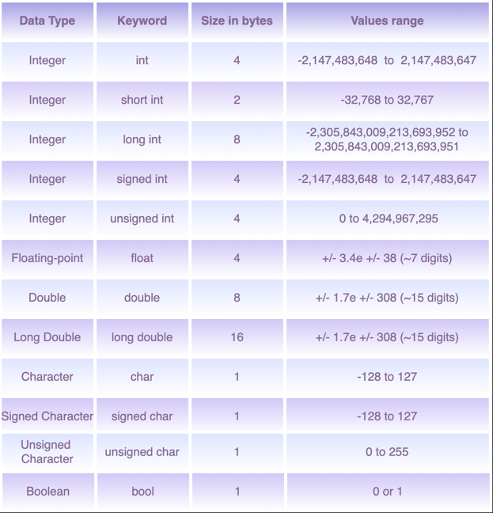
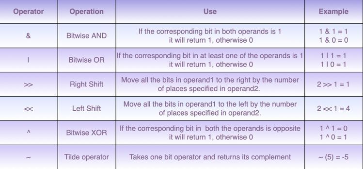
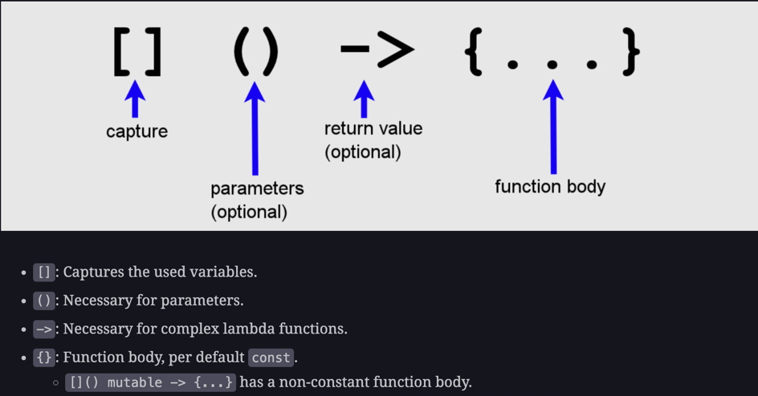

# Basics

This repository will contain basics of cpp code

## List of Contents

### 1 Primitive data types

### 2 Bitwise operators

### 3 Inplace operation
[Cpp primitive is mutable](03_inplace_experiment.cpp)

### 4 Fancy switch
`'a' ... 'z` `'A' ... 'Z'` `'0' ... '9'`

### 5 do while loop
`do {...} while (condition);`

### 6 Pass by value/ pass by reference
[Pass by reference means pass the value itself, so change on the value within function will affect actual value.](06_pass_by_reference.cpp)
Vector: pass by value by default
Arrays: pass by reference by default

### 7 lambda

`[] (int a, int b) -> {return a+b;}`
Refer to Cpp lambda binding for more detail about `[]`, use auto to achieve generic lambda

### 8 Pointer
`int *x` x is a pointer to int, and its value is an address.
`int y; &y` &y is address of int y. So we can do: `int *x, y; x = &y;`.

null pointer is: `nullptr`.

to access value pointed by a pointer (dereference): `int *x; int y = 1; x = &y; *x` use `*ptr`

### dynamic memory allocation/deallocation
`ptr = new primitive; delete ptr;`

`<datatype> *ptr = new primitive[size]; delete[] ptr`;

for 2d allocation/release, just allocate them level by level.